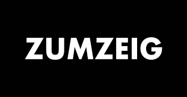

# SmarTablero
Un tablero where I display things I am too lazy to look up, like weather, events, maybe news or discounted pasta?

#### Weather - ideas
- Display info about huimidty
- Get `estadoCielo` and wind
- Get informacio diaria, it's from a different API call of AEMET its forecasting more days ahead
- Add pointer in graph for current time

# Resources
- Weather API [AEMET Open Data](https://opendata.aemet.es/centrodedescargas/inicio)

